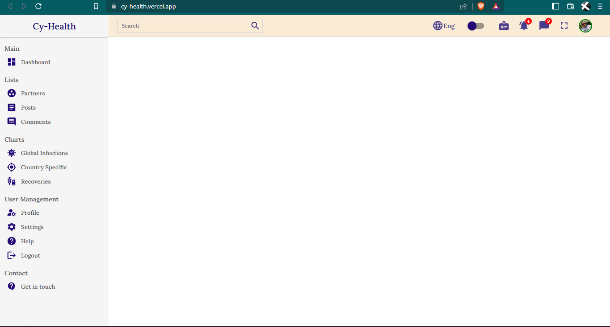
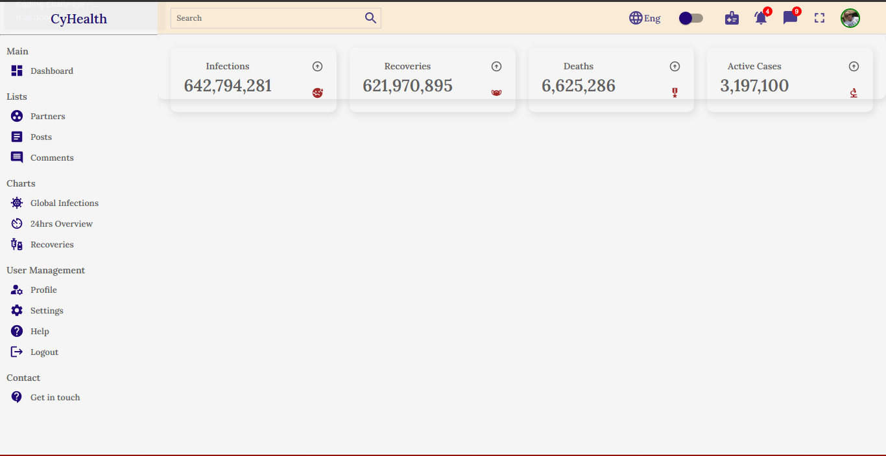
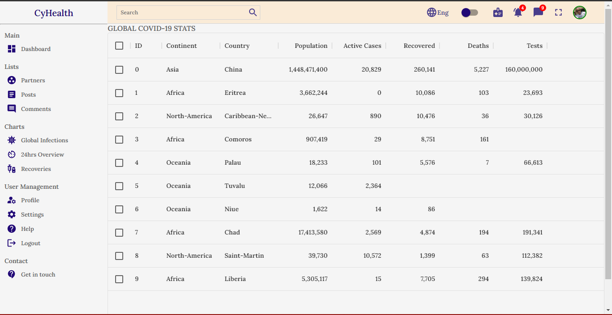
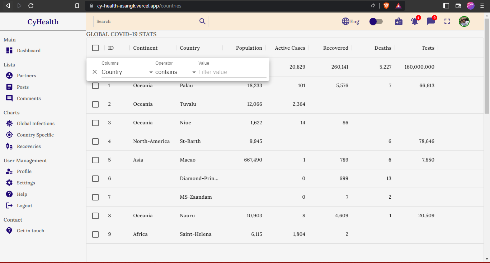

---
CyHEalth

---

This project is being developed and maintained by:
* Allan Kiprop
---
<div id="badges">
  <a href="https://twitter.com/asan_gk">
    
  </a
</div>

---

##Installation

```
Fork/Clone this repository to your local machine.(https://github.com/sang-4/cy-health)
& cd into the project folder
& Run npm install to install all dependencies
& Run npm start to start the app
```

---
##Description

I'm developing CyHealth, a suitable  dashboard for a management system that can serve a wide range of organisations/institutions. This app displaya COVID-19 statistics since 2020 and more updates as the API gets updated. This app is still under development and will be constantly updated. You can filter/search the continets, countries and infections by their respective names. I look forwrd to having a mobile application of the same as soon as I am done with this. You can bookmark this page and be sure to check back later for my recent updates.

---

## Visuals

---







---

##Links

At the moment, configured and completed working links are;

* [Home](https://cy-health-asangk.vercel.app/)
* [Global Stats](https://cy-health-asangk.vercel.app/countries)
* [24hrs Indx](https://cy-health-asangk.vercel.app/single)


---
##Technologies used

* ReactJSX
* SCSS
* HTML
* Postman
* RapidAPI
* YouTube
* StackOverflow

---

##Known Bugs

Ther are no knowm bugs at the moment. Kindly contact me reach me through kipropsallan@gmail.com if you spot any

---

##License

MIT LIcense

---


